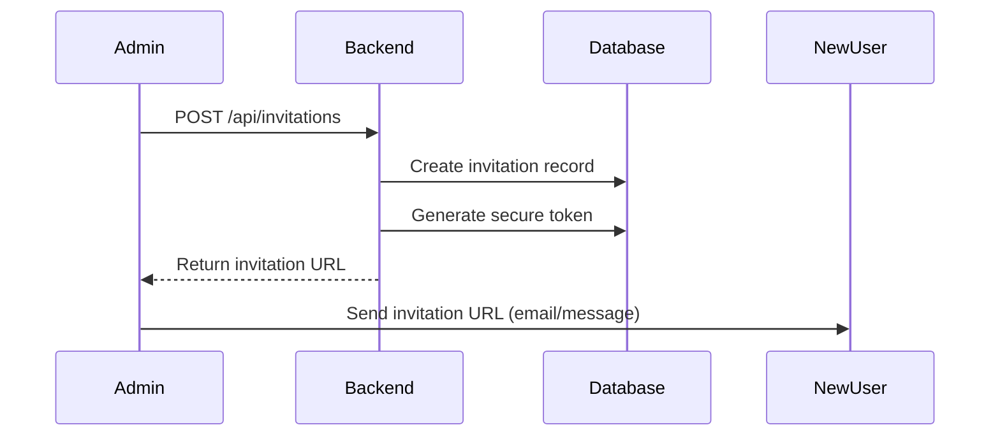
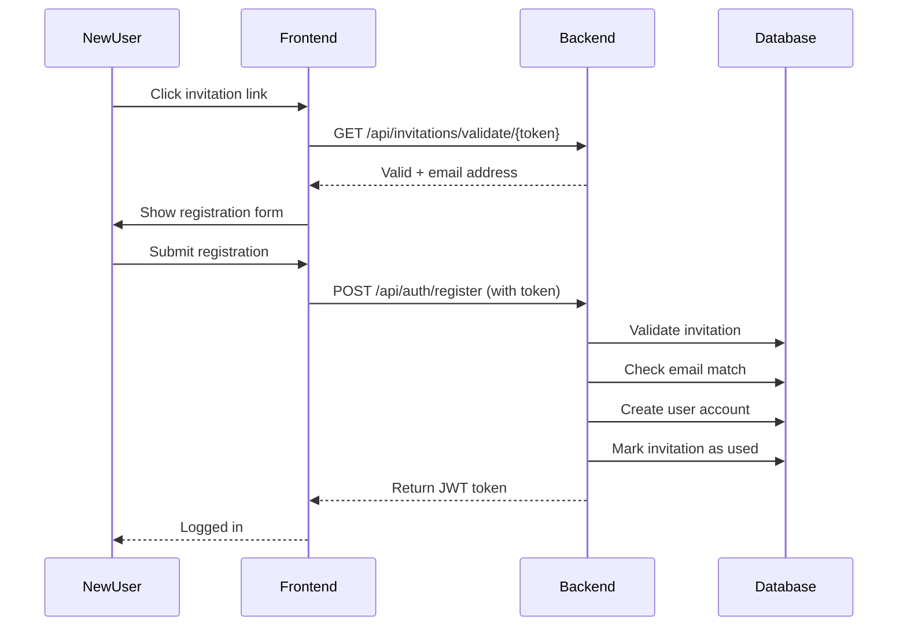

##Invitation-Only Registration System

## Overview

The invitation system ensures controlled access to Herbarium Pro by requiring users to have a valid invitation token before they can register. Only administrators can create and manage invitations.

## Architecture

### Database Tables

#### invitations
Stores all invitation records with the following fields:
- `id`: Primary key
- `email`: Email address of invited user
- `token`: Unique secure token (64 characters, URL-safe)
- `created_by_user_id`: Admin who created the invitation
- `created_at`: When invitation was created
- `expires_at`: Optional expiration timestamp
- `used_at`: When invitation was accepted (NULL if unused)
- `used_by_user_id`: User who used the invitation
- `revoked`: Boolean flag for revoked invitations
- `revoked_at`: When invitation was revoked
- `notes`: Optional notes about the invitation

#### users (modified)
Added `is_admin` column:
- `is_admin`: Boolean flag indicating admin privileges

### Security Features

1. **Secure Token Generation**: Uses `secrets.token_urlsafe(48)` for cryptographically secure tokens
2. **Email Verification**: Registration email must match invitation email
3. **Single-Use Tokens**: Invitations can only be used once
4. **Expiration**: Optional time-based expiration
5. **Revocation**: Admins can revoke invitations before use
6. **Admin-Only Management**: Only admins can create/manage invitations

## Setup

### 1. Run Migration

```bash
cd /home/rree/herman/backend
python add_invitations_system.py
```

This will:
- Create the `invitations` table
- Add `is_admin` column to `users` table
- Make the first existing user an admin (if any)

### 2. Set First Admin

If you don't have any users yet, the first registered user will need to be manually made an admin:

```sql
-- After first user registers
UPDATE users SET is_admin = TRUE WHERE id = 1;
```

Or use the Python script:
```python
from database import SessionLocal
from models import User

db = SessionLocal()
user = db.query(User).filter(User.id == 1).first()
user.is_admin = True
db.commit()
db.close()
```

### 3. Configure Frontend URL (Optional)

Set the `FRONTEND_URL` environment variable for proper invitation URLs:

```bash
# .env file
FRONTEND_URL=https://yourdomain.com
```

Defaults to `http://localhost:3000` if not set.

## API Endpoints

### Admin Endpoints (Require Admin Access)

#### 1. Create Invitation

**POST** `/api/invitations`

Create a new invitation for a user.

**Request Body:**
```json
{
  "email": "newuser@example.com",
  "expires_in_days": 7,  // Optional, defaults to 7
  "notes": "Graduate student - Bot any lab"  // Optional
}
```

**Response:**
```json
{
  "id": 1,
  "email": "newuser@example.com",
  "token": "long-secure-random-token",
  "created_at": "2026-02-04T10:00:00",
  "expires_at": "2026-02-11T10:00:00",
  "used_at": null,
  "revoked": false,
  "notes": "Graduate student - Botany lab",
  "invitation_url": "http://localhost:3000/register?token=long-secure-random-token"
}
```

**Example:**
```bash
curl -X POST http://localhost:8000/api/invitations \
  -H "Authorization: Bearer YOUR_ADMIN_TOKEN" \
  -H "Content-Type: application/json" \
  -d '{
    "email": "newuser@example.com",
    "expires_in_days": 7,
    "notes": "New lab member"
  }'
```

#### 2. List Invitations

**GET** `/api/invitations?status_filter={filter}`

List all invitations with optional filtering.

**Query Parameters:**
- `status_filter`: Optional filter
  - `pending`: Unused, not revoked, not expired
  - `used`: Already used
  - `revoked`: Revoked by admin
  - `expired`: Past expiration date

**Response:**
```json
{
  "invitations": [
    {
      "id": 1,
      "email": "user1@example.com",
      "token": "token1",
      "created_at": "2026-02-04T10:00:00",
      "expires_at": "2026-02-11T10:00:00",
      "used_at": null,
      "revoked": false,
      "notes": "Lab member",
      "invitation_url": "http://localhost:3000/register?token=token1"
    }
  ],
  "total": 1
}
```

**Example:**
```bash
# Get all pending invitations
curl http://localhost:8000/api/invitations?status_filter=pending \
  -H "Authorization: Bearer YOUR_ADMIN_TOKEN"
```

#### 3. Revoke Invitation

**DELETE** `/api/invitations/{invitation_id}`

Revoke an invitation to prevent it from being used.

**Response:**
```json
{
  "message": "Invitation revoked successfully"
}
```

**Example:**
```bash
curl -X DELETE http://localhost:8000/api/invitations/1 \
  -H "Authorization: Bearer YOUR_ADMIN_TOKEN"
```

#### 4. Resend/Refresh Invitation

**POST** `/api/invitations/{invitation_id}/resend`

Generate a new token and extend expiration for an existing invitation.

**Response:**
```json
{
  "id": 1,
  "email": "user@example.com",
  "token": "new-token",
  "created_at": "2026-02-04T10:00:00",
  "expires_at": "2026-02-11T15:30:00",  // Extended by 7 days from now
  "used_at": null,
  "revoked": false,
  "notes": "Lab member",
  "invitation_url": "http://localhost:3000/register?token=new-token"
}
```

**Example:**
```bash
curl -X POST http://localhost:8000/api/invitations/1/resend \
  -H "Authorization: Bearer YOUR_ADMIN_TOKEN"
```

### Public Endpoints (No Auth Required)

#### 5. Validate Invitation Token

**GET** `/api/invitations/validate/{token}`

Check if an invitation token is valid.

**Response:**
```json
{
  "valid": true,
  "email": "user@example.com",
  "message": "Valid invitation"
}
```

Or if invalid:
```json
{
  "valid": false,
  "email": "user@example.com",
  "message": "This invitation has expired"
}
```

**Example:**
```bash
curl http://localhost:8000/api/invitations/validate/long-token-here
```

### Modified Registration Endpoint

#### Register with Invitation

**POST** `/api/auth/register`

Register a new user account using an invitation token.

**Form Data:**
- `email`: Must match invitation email
- `password`: Minimum 6 characters
- `name`: Optional
- `institution`: Optional
- `invitation_token`: Required, must be valid

**Example:**
```bash
curl -X POST http://localhost:8000/api/auth/register \
  -F "email=newuser@example.com" \
  -F "password=securepassword123" \
  -F "name=John Doe" \
  -F "institution=University Lab" \
  -F "invitation_token=long-secure-token"
```

## Invitation Workflow

### Creating an Invitation



### Registration with Invitation



## Common Use Cases

### 1. Invite a New Lab Member

```python
# Admin creates invitation
import requests

response = requests.post(
    'http://localhost:8000/api/invitations',
    headers={'Authorization': f'Bearer {admin_token}'},
    json={
        'email': 'newmember@lab.edu',
        'expires_in_days': 14,
        'notes': 'PhD student in botany'
    }
)

invitation = response.json()
print(f"Send this link: {invitation['invitation_url']}")
```

### 2. Check Pending Invitations

```python
# List all pending invitations
response = requests.get(
    'http://localhost:8000/api/invitations?status_filter=pending',
    headers={'Authorization': f'Bearer {admin_token}'}
)

pending = response.json()
print(f"Pending invitations: {pending['total']}")
for inv in pending['invitations']:
    print(f"- {inv['email']} (expires {inv['expires_at']})")
```

### 3. Revoke an Invitation

```python
# Revoke if user should no longer have access
requests.delete(
    f'http://localhost:8000/api/invitations/{invitation_id}',
    headers={'Authorization': f'Bearer {admin_token}'}
)
```

### 4. Resend Expired Invitation

```python
# Generate new token and extend expiration
response = requests.post(
    f'http://localhost:8000/api/invitations/{invitation_id}/resend',
    headers={'Authorization': f'Bearer {admin_token}'}
)

new_invitation = response.json()
print(f"New link: {new_invitation['invitation_url']}")
```

## Admin Management

### Promote User to Admin

Via SQL:
```sql
UPDATE users SET is_admin = TRUE WHERE email = 'user@example.com';
```

Via Python:
```python
from database import SessionLocal
from models import User

db = SessionLocal()
user = db.query(User).filter(User.email == 'user@example.com').first()
if user:
    user.is_admin = True
    db.commit()
    print(f"User {user.email} is now an admin")
db.close()
```

### Check Admin Status

```python
from database import SessionLocal
from models import User

db = SessionLocal()
admins = db.query(User).filter(User.is_admin == True).all()
print(f"Admins: {[u.email for u in admins]}")
db.close()
```

## Security Considerations

### Token Security
- Tokens are 64-character URL-safe random strings
- Use HTTPS in production to protect tokens in transit
- Tokens are single-use and invalidated after registration
- Store invitation URLs securely (don't log or expose publicly)

### Email Verification
- Registration email MUST match invitation email
- Case-insensitive comparison
- Prevents invitation sharing/abuse

### Expiration
- Default 7-day expiration
- Configurable per invitation
- Expired invitations cannot be used
- Use resend endpoint to generate new token

### Revocation
- Admins can revoke invitations at any time
- Revoked invitations cannot be used
- Cannot revoke already-used invitations

### Rate Limiting (Recommended)
Consider adding rate limiting to registration endpoint to prevent brute-force token attacks:

```python
# Example using slowapi
from slowapi import Limiter
from slowapi.util import get_remote_address

limiter = Limiter(key_func=get_remote_address)

@app.post("/api/auth/register")
@limiter.limit("5/hour")  # Max 5 registration attempts per hour per IP
async def register(...):
    ...
```

## Email Integration (Optional Enhancement)

### Send Invitation Emails

Instead of manually sending links, integrate email sending:

```python
# Example with smtplib
import smtplib
from email.mime.text import MIMEText
from email.mime.multipart import MIMEMultipart

def send_invitation_email(email: str, invitation_url: str, admin_name: str):
    sender = "noreply@yourlab.edu"

    message = MIMEMultipart()
    message["From"] = sender
    message["To"] = email
    message["Subject"] = "Invitation to Herbarium Pro"

    body = f"""
    Hello,

    You've been invited by {admin_name} to join Herbarium Pro.

    Click the link below to register your account:
    {invitation_url}

    This invitation will expire in 7 days.

    Best regards,
    Herbarium Pro Team
    """

    message.attach(MIMEText(body, "plain"))

    with smtplib.SMTP("smtp.yourlab.edu", 587) as server:
        server.starttls()
        server.login("username", "password")
        server.send_message(message)
```

Update create_invitation endpoint:
```python
@app.post("/api/invitations", ...)
async def create_invitation(...):
    # ... create invitation ...

    # Send email
    try:
        send_invitation_email(
            new_invitation.email,
            invitation_url,
            admin_user.name or admin_user.email
        )
    except Exception as e:
        print(f"Failed to send email: {e}")

    return response
```

## Monitoring & Analytics

### Track Invitation Usage

```sql
-- Acceptance rate
SELECT
    COUNT(*) as total_invitations,
    SUM(CASE WHEN used_at IS NOT NULL THEN 1 ELSE 0 END) as used_count,
    ROUND(100.0 * SUM(CASE WHEN used_at IS NOT NULL THEN 1 ELSE 0 END) / COUNT(*), 2) as acceptance_rate
FROM invitations
WHERE revoked = FALSE;

-- Average time to accept
SELECT
    AVG(TIMESTAMPDIFF(HOUR, created_at, used_at)) as avg_hours_to_accept
FROM invitations
WHERE used_at IS NOT NULL;

-- Invitations by admin
SELECT
    u.email as admin_email,
    COUNT(*) as invitations_sent,
    SUM(CASE WHEN i.used_at IS NOT NULL THEN 1 ELSE 0 END) as accepted_count
FROM invitations i
JOIN users u ON i.created_by_user_id = u.id
GROUP BY u.id, u.email
ORDER BY invitations_sent DESC;
```

## Troubleshooting

### "Invalid invitation token"
- Token may be expired, revoked, or already used
- Check invitation status in database
- Use `/api/invitations/validate/{token}` to check status

### "Email does not match invitation"
- User must register with exact email from invitation
- Check for typos or case differences (comparison is case-insensitive)

### "Admin access required"
- User's `is_admin` flag is FALSE
- Manually set to TRUE in database
- Only admins can manage invitations

### "Email already registered"
- User account already exists with that email
- Use password reset instead of new invitation
- Delete old account if needed

## Best Practices

1. **Set Reasonable Expiration**: 7-14 days is usually sufficient
2. **Add Notes**: Document why each person was invited
3. **Monitor Usage**: Check pending invitations periodically
4. **Revoke Unused**: Clean up old unused invitations
5. **Send Reminders**: Follow up if invitation not used within a few days
6. **Use HTTPS**: Always use HTTPS in production
7. **Backup Tokens**: Keep record of sent invitations for support
8. **Limit Admins**: Only make trusted users admins

## Migration from Open Registration

If you previously had open registration:

1. Existing users are unaffected
2. Registration endpoint now requires invitation token
3. Make at least one existing user an admin
4. Admin can then invite new users
5. Consider sending invitations to any pending users who tried to register
